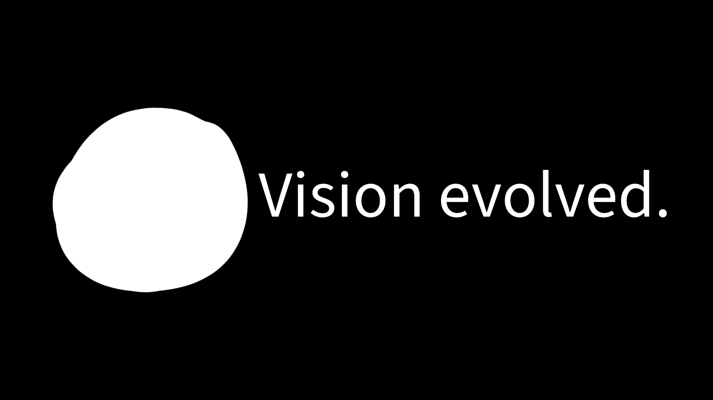

     
    

 
 
    「 Building @ <b><a href="https://endrcompany.com/">Endr</a></b> 」
 
    
3rd year Computer Engineering and Chinese student passionate about AI for national defense and support. Current research in Computer Vision - specializing in critical object detection/tracking, and terrain classification for robotics applications.

 

Portfolio: <a href="https://ezekielmitchell.github.io/">ezekielmitchell.github.io</a>

    
Toolbox
---

  
  
  
  
  
  
  
  
  
  
  

Connect
---

